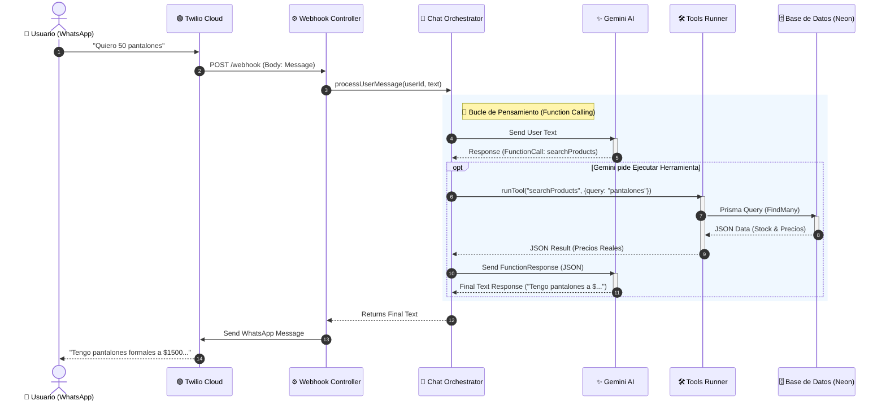

# 📘 Documentación Técnica - Laburen AI Agent

Este servicio implementa un **Agente de IA Transaccional** para WhatsApp. Actúa como un vendedor mayorista automatizado capaz de consultar stock en tiempo real, negociar precios escalonados y cerrar pedidos complejos sin intervención humana, evitando alucinaciones mediante el uso de herramientas deterministas.

---

## 🏗 Arquitectura y Flujo

El sistema utiliza un **Orquestador de Chat** que interviene entre el usuario y el LLM (Gemini). Si la IA decide que necesita datos (ej: ver stock), el orquestador pausa la conversación, ejecuta la consulta a la base de datos y le inyecta los datos reales a la IA antes de responder al usuario.



## 🛠 Stack Tecnológico

- **Runtime:** Node.js v22 (LTS) & TypeScript
- **Framework Web:** Express.js
- **Base de Datos:** PostgreSQL (alojada en Neon Tech)
- **ORM:** Prisma (con manejo de transacciones ACID)
- **Inteligencia Artificial:** Google Gemini 2.5 Flash (Function Calling enabled, Temperature 0)
- **Mensajería:** Twilio API (WhatsApp Sandbox/Production)
- **Infraestructura:** Render (Web Service)

---

## 🔗 Endpoints API

### 1. Comunicación (WhatsApp Webhook)

#### `POST /webhook`

Punto de entrada principal para eventos de Twilio. El orquestador recibe el mensaje aquí.

- **Body:** Form-UrlEncoded (Standard Twilio: `From`, `Body`, etc.)
- **Respuesta:** `200 OK` (Respuesta asíncrona vía Twilio Client).

---

### 2. Gestión de Productos (Inventory)

#### `GET /products`

Busca productos en el catálogo.

- **Query Params:**
  - `q` (Opcional): Texto para buscar por nombre o descripción (búsqueda difusa/insensitive).
- **Respuesta:** Array de objetos `Product`.

#### `GET /products/:id`

Obtiene el detalle de un producto específico.

- **Respuesta:** Objeto `Product` o `404 Not Found`.

#### `GET /products/names` (o la ruta que hayas definido para `getNames`)

Obtiene un listado agrupado de nombres de productos disponibles (Stock >= 50). Útil para menús o autocompletado.

- **Respuesta:**
  ```json
  [
    { "name": "Camisa Formal", "_count": { "name": 5 } },
    { "name": "Pantalón Chino", "_count": { "name": 3 } }
  ]
  ```

---

### 3. Gestión de Pedidos (Carts)

#### `POST /carts`

Crea un nuevo carrito de compras con validación estricta de stock (Transacción ACID).

- **Body:**
  ```json
  {
    "items": [
      { "product_id": 1, "qty": 50 },
      { "product_id": 4, "qty": 100 }
    ]
  }
  ```
- **Validaciones:**
  - Verifica existencia del producto.
  - Verifica `stock >= qty`.
  - Verifica regla de negocio `qty >= 50` (Venta Mayorista).
- **Respuesta:** `201 Created` con el objeto `Cart` completo.
- **Errores:** `400 Bad Request` si falla validación de stock/negocio.

#### `PATCH /carts/:id`

Actualiza las cantidades de un carrito existente.

- **Nota:** Este endpoint actualiza cantidades o elimina items (si `qty <= 0`), pero no ejecuta la validación compleja de "compra mínima inicial" nuevamente, asume corrección del lado del cliente/bot.
- **Body:**
  ```json
  {
    "items": [
      { "product_id": 1, "qty": 60 },
      { "product_id": 4, "qty": 0 }
    ]
  }
  ```
- **Respuesta:** `200 OK` con el objeto `Cart` actualizado.

## 🧠 Capacidades del Agente (AI Tools)

El agente está configurado con `temperature: 0` y tiene prohibido inventar datos. Utiliza las siguientes herramientas conectadas a la base de datos en tiempo real:

### `searchProducts(query: string)`

Motor de búsqueda inteligente de inventario mayorista.

- **Lógica de Búsqueda:**
  - **Query vacío (`""`):** Retorna un menú agrupado de categorías y los tipos de productos disponibles en cada una.
  - **Query específico:** Realiza una búsqueda difusa (`insensitive`) por nombre o categoría.
  - **Fallback Inteligente:** Si no encuentra por plural (ej: "Faldas"), reintenta automáticamente por singular ("Falda") o raíz ("Fald") antes de responder.
  - **Filtro Mayorista:** Solo retorna productos con `stock >= 50`.
- **Salida:** JSON estructurado con precios reales y talles agrupados por color.

### `createCart(items: Array)`

Generador de pedidos transaccionales.

- **Lógica:** Recibe una lista de IDs de productos y cantidades.
- **Validación ACID:** Dentro de una transacción de base de datos (`prisma.$transaction`), verifica nuevamente que el stock sea suficiente y que la cantidad solicitada cumpla con el mínimo mayorista (50u) antes de descontar inventario.
- **Salida:** ID del carrito confirmado o error descriptivo (ej: "Stock insuficiente").

---

## 📂 Estructura del Proyecto

```bash
src/
├── app.ts                 # Configuración de Express y rutas
├── controllers/
│   └── webhook.controller.ts  # Controlador del endpoint /webhook
│   └── product.controller.ts  # Controlador que maneja los productos
│   └── carts.controller.ts    # Controlador que maneja los carritos
├── services/
│   ├── ai.service.ts      # Configuración de Gemini, System Prompt y Tools def
│   ├── chat.service.ts    # ORQUESTADOR: Bucle de ejecución de herramientas
│   ├── tools.runner.ts    # EJECUTOR: Lógica de negocio y consultas Prisma
│   ├── order.service.ts   # Lógica transaccional de creación de pedidos
│   └── twilio.service.ts  # Cliente para enviar mensajes a WhatsApp
├── prisma/
│   └── products.xlsx          # Excel donde sacamos la data
│   └── seed.ts                # Poblamos la bbdd extraemos de products
│   └── schema.prisma          # Esquema de Base de Datos y Modelos
├── routes/
│   └── carts.routes.ts    # Maneja las rutas de carritos
│   └── product.routes.ts  # Maneja las rutas de productos
│   └── webhook.routes.ts  # Maneja las rutas de la webhook
├── lib/
│   └── sessions.ts        # Maneja las sesiones de los chats
├── config/
│   └── swagger.ts         # Configura swagger para la prueba de la API
```
