# 📘 Documentación Técnica - Laburen AI Agent

Este servicio implementa un **Agente de IA Transaccional** para WhatsApp. Actúa como un vendedor mayorista automatizado capaz de consultar stock en tiempo real, negociar precios escalonados y cerrar pedidos complejos sin intervención humana, evitando alucinaciones mediante el uso de herramientas deterministas.

---

## 🏗 Arquitectura y Flujo

El sistema utiliza un **Orquestador de Chat** que interviene entre el usuario y el LLM (Gemini). Si la IA decide que necesita datos (ej: ver stock), el orquestador pausa la conversación, ejecuta la consulta a la base de datos y le inyecta los datos reales a la IA antes de responder al usuario.

```mermaid
sequenceDiagram
    autonumber
    actor User as 👤 Usuario (WhatsApp)
    participant Twilio as 🟢 Twilio Cloud
    participant Webhook as ⚙️ Webhook Controller
    participant Orch as 🧠 Chat Orchestrator
    participant Gemini as ✨ Gemini AI
    participant Tools as 🛠️ Tools Runner
    participant DB as 🗄️ Base de Datos (Neon)

    User->>Twilio: "Quiero 50 pantalones"
    Twilio->>Webhook: POST /webhook (Body: Message)
    Webhook->>Orch: processUserMessage(userId, text)

    rect rgb(240, 248, 255)
        note right of Orch: 🔄 Bucle de Pensamiento (Function Calling)
        Orch->>Gemini: Send User Text
        activate Gemini
        Gemini-->>Orch: Response (FunctionCall: searchProducts)
        deactivate Gemini

        opt Gemini pide Ejecutar Herramienta
            Orch->>Tools: runTool("searchProducts", {query: "pantalones"})
            activate Tools
            Tools->>DB: Prisma Query (FindMany)
            activate DB
            DB-->>Tools: JSON Data (Stock & Precios)
            deactivate DB
            Tools-->>Orch: JSON Result (Precios Reales)
            deactivate Tools

            Orch->>Gemini: Send FunctionResponse (JSON)
            activate Gemini
            Gemini-->>Orch: Final Text Response ("Tengo pantalones a $...")
            deactivate Gemini
        end
    end

    Orch-->>Webhook: Returns Final Text
    Webhook->>Twilio: Send WhatsApp Message
    Twilio-->>User: "Tengo pantalones formales a $1500..."
```



## 🛠 Stack Tecnológico

- **Runtime:** Node.js v22 (LTS) & TypeScript
- **Framework Web:** Express.js
- **Base de Datos:** PostgreSQL (alojada en Neon Tech)
- **ORM:** Prisma (con manejo de transacciones ACID)
- **Inteligencia Artificial:** Google Gemini 2.5 Flash (Function Calling enabled, Temperature 0)
- **Mensajería:** Twilio API (WhatsApp Sandbox/Production)
- **Infraestructura:** Render (Web Service)

---

## 🔗 Endpoints API

### 1. Recepción de Mensajes (Webhook)

Punto de entrada principal para eventos de Twilio.

- **URL:** `/webhook`
- **Método:** `POST`
- **Content-Type:** `application/x-www-form-urlencoded`

**Parámetros del Body (Twilio Standard):**

| Parámetro     | Tipo   | Descripción                                   |
| :------------ | :----- | :-------------------------------------------- |
| `From`        | String | Número del usuario (ej: `whatsapp:+54911...`) |
| `Body`        | String | El texto del mensaje enviado por el usuario.  |
| `ProfileName` | String | Nombre público del perfil de WhatsApp.        |

**Respuesta:**

- **Código:** `200 OK`
- **Body:** Texto plano (vacío). La respuesta al usuario se envía de forma asíncrona mediante la API de Twilio para evitar timeouts.

### 2. Health Check

Endpoint para monitoreo de uptime (Ping de Render para evitar "Cold Starts").

- **URL:** `/health` (o `/`)
- **Método:** `GET`
- **Respuesta:** `200 OK` - "Server is running"

---

## 🧠 Capacidades del Agente (AI Tools)

El agente está configurado con `temperature: 0` y tiene prohibido inventar datos. Utiliza las siguientes herramientas conectadas a la base de datos en tiempo real:

### `searchProducts(query: string)`

Motor de búsqueda inteligente de inventario mayorista.

- **Lógica de Búsqueda:**
  - **Query vacío (`""`):** Retorna un menú agrupado de categorías y los tipos de productos disponibles en cada una.
  - **Query específico:** Realiza una búsqueda difusa (`insensitive`) por nombre o categoría.
  - **Fallback Inteligente:** Si no encuentra por plural (ej: "Faldas"), reintenta automáticamente por singular ("Falda") o raíz ("Fald") antes de responder.
  - **Filtro Mayorista:** Solo retorna productos con `stock >= 50`.
- **Salida:** JSON estructurado con precios reales y talles agrupados por color.

### `createCart(items: Array)`

Generador de pedidos transaccionales.

- **Lógica:** Recibe una lista de IDs de productos y cantidades.
- **Validación ACID:** Dentro de una transacción de base de datos (`prisma.$transaction`), verifica nuevamente que el stock sea suficiente y que la cantidad solicitada cumpla con el mínimo mayorista (50u) antes de descontar inventario.
- **Salida:** ID del carrito confirmado o error descriptivo (ej: "Stock insuficiente").

---

## 📂 Estructura del Proyecto

```bash
src/
├── app.ts                 # Configuración de Express y rutas
├── controllers/
│   └── webhook.controller.ts  # Controlador del endpoint /webhook
├── services/
│   ├── ai.service.ts      # Configuración de Gemini, System Prompt y Tools def
│   ├── chat.service.ts    # ORQUESTADOR: Bucle de ejecución de herramientas
│   ├── tools.runner.ts    # EJECUTOR: Lógica de negocio y consultas Prisma
│   ├── order.service.ts   # Lógica transaccional de creación de pedidos
│   └── twilio.service.ts  # Cliente para enviar mensajes a WhatsApp
└── prisma/
    └── schema.prisma      # Esquema de Base de Datos y Modelos
```
